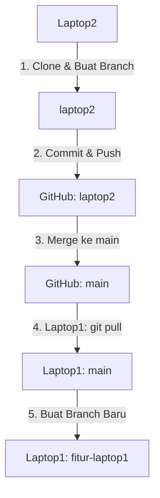

<p align="center"><a href="https://laravel.com" target="_blank"></a></p>

<p align="center">
<a href="https://github.com/laravel/framework/actions"></a>
<a href="https://packagist.org/packages/laravel/framework"></a>
<a href="https://packagist.org/packages/laravel/framework"></a>
<a href="https://packagist.org/packages/laravel/framework"></a>
</p>

## About Laravel

Laravel is a web application framework with expressive, elegant syntax. We believe development must be an enjoyable and creative experience to be truly fulfilling. Laravel takes the pain out of development by easing common tasks used in many web projects, such as:

- [Simple, fast routing engine](https://laravel.com/docs/routing).
- [Powerful dependency injection container](https://laravel.com/docs/container).
- Multiple back-ends for [session](https://laravel.com/docs/session) and [cache](https://laravel.com/docs/cache) storage.
- Expressive, intuitive [database ORM](https://laravel.com/docs/eloquent).
- Database agnostic [schema migrations](https://laravel.com/docs/migrations).
- [Robust background job processing](https://laravel.com/docs/queues).
- [Real-time event broadcasting](https://laravel.com/docs/broadcasting).

Laravel is accessible, powerful, and provides tools required for large, robust applications.

## Learning Laravel

Laravel has the most extensive and thorough [documentation](https://laravel.com/docs) and video tutorial library of all modern web application frameworks, making it a breeze to get started with the framework.

You may also try the [Laravel Bootcamp](https://bootcamp.laravel.com), where you will be guided through building a modern Laravel application from scratch.

If you don't feel like reading, [Laracasts](https://laracasts.com) can help. Laracasts contains thousands of video tutorials on a range of topics including Laravel, modern PHP, unit testing, and JavaScript. Boost your skills by digging into our comprehensive video library.

## Laravel Sponsors

We would like to extend our thanks to the following sponsors for funding Laravel development. If you are interested in becoming a sponsor, please visit the [Laravel Partners program](https://partners.laravel.com).

### Premium Partners

- **[Vehikl](https://vehikl.com/)**
- **[Tighten Co.](https://tighten.co)**
- **[WebReinvent](https://webreinvent.com/)**
- **[Kirschbaum Development Group](https://kirschbaumdevelopment.com)**
- **[64 Robots](https://64robots.com)**
- **[Curotec](https://www.curotec.com/services/technologies/laravel/)**
- **[Cyber-Duck](https://cyber-duck.co.uk)**
- **[DevSquad](https://devsquad.com/hire-laravel-developers)**
- **[Jump24](https://jump24.co.uk)**
- **[Redberry](https://redberry.international/laravel/)**
- **[Active Logic](https://activelogic.com)**
- **[byte5](https://byte5.de)**
- **[OP.GG](https://op.gg)**

## Contributing

Thank you for considering contributing to the Laravel framework! The contribution guide can be found in the [Laravel documentation](https://laravel.com/docs/contributions).

## Code of Conduct

In order to ensure that the Laravel community is welcoming to all, please review and abide by the [Code of Conduct](https://laravel.com/docs/contributions#code-of-conduct).

## Security Vulnerabilities

If you discover a security vulnerability within Laravel, please send an e-mail to Taylor Otwell via [taylor@laravel.com](mailto:taylor@laravel.com). All security vulnerabilities will be promptly addressed.

## License

The Laravel framework is open-sourced software licensed under the [MIT license](https://opensource.org/licenses/MIT).

---

## **📌 MODUL ALUR KERJA GIT (Laptop2 → GitHub → Laptop1)**  
### **🔹 1. Persiapan Awal di Laptop2**  
**Tujuan:** Clone repositori dan buat branch kerja (`laptop2`).  
```bash
# Clone repositori (jika belum ada di Laptop2)
git clone https://github.com/username/mata-raung.git
cd mata-raung

# Buat branch baru untuk kerja di Laptop2
git checkout -b laptop2
```

---

### **🔹 2. Bekerja di Laptop2**  
**Tujuan:** Lakukan perubahan, commit, dan push ke branch `laptop2`.  
```bash
# Setelah selesai mengedit file:
git add .
git commit -m "Deskripsi perubahan di Laptop2"

# Push ke branch laptop2 di GitHub
git push origin laptop2
```

---

### **🔹 3. Gabungkan Perubahan ke `main` (Jika Sudah Final)**  
**Tujuan:** Merge `laptop2` ke `main` dan update GitHub.  
```bash
# Pindah ke branch main
git checkout main

# Update main dengan perubahan terbaru dari GitHub
git pull origin main

# Gabungkan laptop2 ke main
git merge laptop2

# Push main yang sudah di-update ke GitHub
git push origin main
```

---

### **🔹 4. Jika Ingin Lanjut Bekerja di Laptop2**  
**Tujuan:** Tetap gunakan branch `laptop2` untuk isolasi perubahan.  
```bash
# Kembali ke branch laptop2
git checkout laptop2

# Lanjutkan pekerjaan, lalu ulangi langkah 2 (add, commit, push)
```

---

### **🔹 5. Persiapan di Laptop1 (Ketika Sudah Hidup Lagi)**  
**Tujuan:** Ambil semua perubahan terbaru dari GitHub.  
```bash
# Pastikan folder proyek sudah ada di Laptop1
cd mata-raung

# Update branch main
git checkout main
git pull origin main

# Jika ingin kerja di Laptop1, buat branch baru
git checkout -b fitur-laptop1
```

---

### **🔹 6. Sinkronisasi Antar Laptop**  
**Tujuan:** Pastikan Laptop1 dan Laptop2 selalu up-to-date.  
```bash
# Di Laptop1/Laptop2, selalu lakukan ini sebelum mulai kerja:
git checkout main
git pull origin main

# Jika ada branch lama (laptop2) yang sudah di-merge, bisa dihapus
git branch -d laptop2
```

---

## **📌 Bagan Alur Visual**  


---

## **📌 Best Practices**  
1. **Selalu pakai branch terpisah** (jangan kerja langsung di `main`).  
2. **Pull sebelum push** untuk hindari konflik.  
3. **Commit message jelas** (contoh: "Fix login error").  
4. **Hapus branch lama** yang sudah di-merge (agar rapi).  

---

## **📌 Contoh Kasus Nyata**  
### **Misal Anda tambah fitur baru di Laptop2:**  
```bash
git checkout laptop2
# Edit file
git add .
git commit -m "Tambah fitur pencarian"
git push origin laptop2

# Setelah testing, merge ke main
git checkout main
git pull origin main
git merge laptop2
git push origin main
```

### **Saat buka Laptop1:**  
```bash
git checkout main
git pull origin main  # Dapatkan fitur pencarian yang tadi di-merge
```

---

Dengan alur ini, Anda bisa kerja fleksibel di **Laptop1/Laptop2** tanpa takut kehilangan perubahan. 🚀  

**Tips:** Simpan modul ini di file `README.md` di repo Anda untuk referensi!
